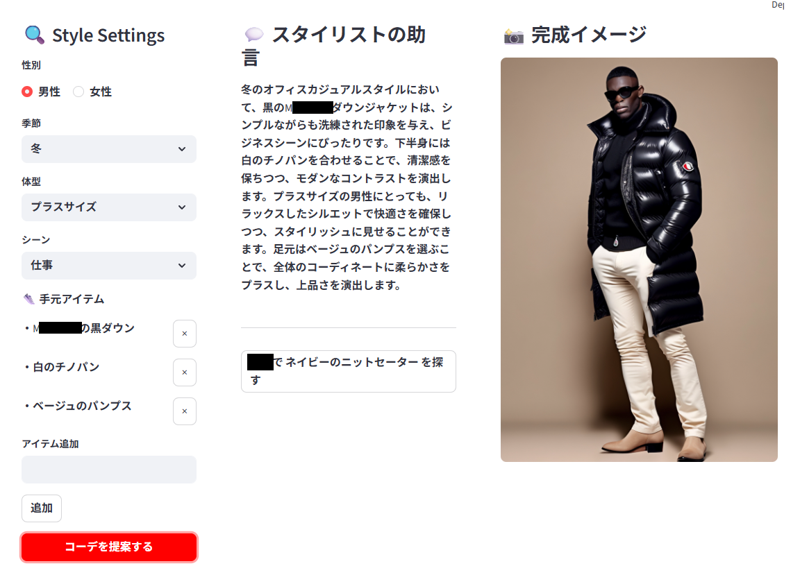

# AI Fashion Stylist Pro 👠❄️

**AI Fashion Stylist Pro** は、手持ちのアイテムとシーン（TPO）に合わせて、プロフェッショナルなコーディネートを提案・可視化するStreamlitアプリケーションです。

## 🌟 主な機能

* **インテリジェント・スタイリング**: GPT-4o-miniがあなたのクローゼットとシーン（仕事、デート等）を分析し、最適な助言を提供します。
* **高精度イメージ生成**: Stability AI (SDXL) を活用し、提案されたコーデを9:16の縦長全身ショットで可視化します。
* **ブランド・テクスチャ再現**: 特定のブランドアイテムの特徴をプロンプトエンジニアリングで忠実に再現。
* **スマート・ショッピング**: 提案された新しいアイテムを、ワンクリックで楽天やAmazonから検索（属性付き検索）できます。
* **TPOガード**: 「仕事」シーンでのダメージデニム排除など、マナーに配慮したフィルタリング機能を搭載。

## 🛠 技術スタック

* **Frontend**: [Streamlit](https://streamlit.io/)
* **LLM**: [OpenAI GPT-4o-mini](https://openai.com/) (LangChain)
* **Image Gen**: [Stability AI SDXL 1.0](https://stability.ai/)
* **Authentication**: `streamlit-authenticator`
* **Environment**: Python 3.11+ / `python-dotenv`

## 🚀 セットアップ

1. **リポジトリのクローン**
```bash
git clone https://github.com/miwacci/ai_fashion_app.git
cd ai_fashion_app

```


2. **仮想環境の作成とライブラリのインストール**
```bash
python -m venv venv
source venv/bin/activate  # Windowsの場合: venv\Scripts\activate
pip install -r requirements.txt

```


3. **環境変数の設定**
プロジェクトルートに `.env` ファイルを作成し、各APIキーを記述してください。
```env
OPENAI_API_KEY=sk-proj-xxxxxxxxxxxx
STABILITY_KEY=xxxxxxxxxxxx

```


4. **アプリの起動**
```bash
streamlit run app.py

```


## 📸 スクリーンショット例

> **Scenario**: 冬の「仕事」シーン ❄️👔
> **Items**: MXXXXXの黒ダウン × 白のチノパン × ベージュのパンプス
> AIが「黒ダウンの重厚感」と「白パンツの清潔感」を両立させ、ビジネスに相応しいマットな質感で描画します。


---

## 📄 ライセンス

Copyright © 2026 AI Fashion Stylist Pro.
This project is for educational and portfolio purposes.

---