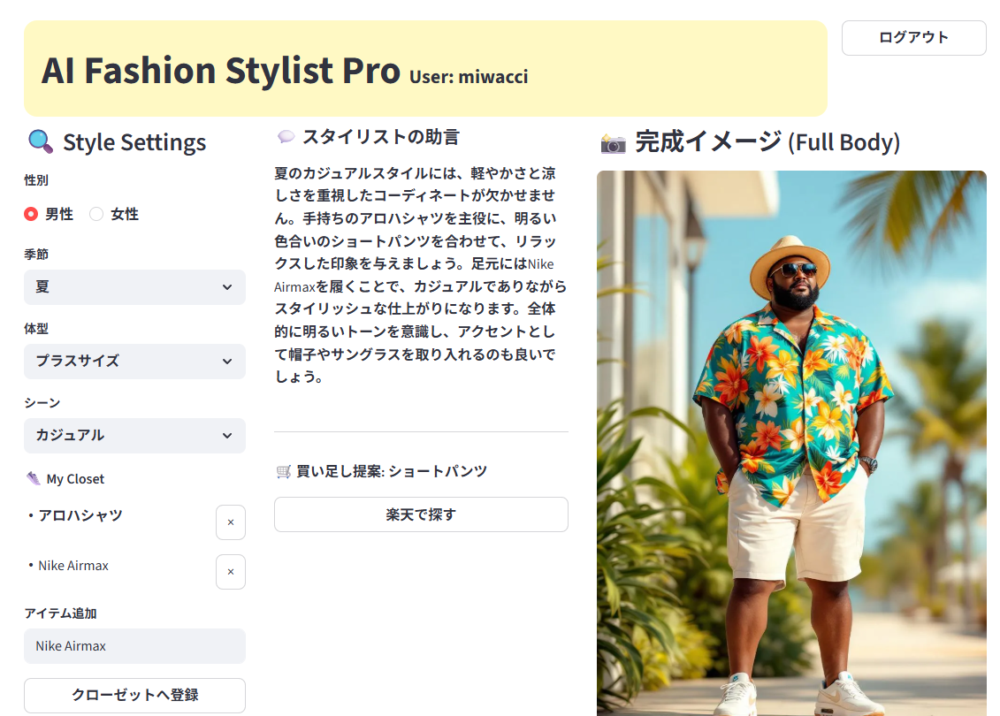

⚠️ これはテスト環境です。修正はここで実験してからmainへ！

# 👗 AI Fashion Stylist Pro

**あなたのクローゼットに眠る逸品を、AIが最高のコーディネートへ昇華させる。**

AI Fashion Stylist Proは、個人のクローゼット資産と最新のファッション・インテリジェンスを融合させた、パーソナライズ・スタイリング・プラットフォームです。

## 🔗 Live Demo

実際に稼働中のデモはこちらからご確認いただけます。

* **URL:** [https://jd7afbhhfrpuskq58z3qpx.streamlit.app/](https://jd7afbhhfrpuskq58z3qpx.streamlit.app/)
* **デモアカウント:**
* ユーザー名: `demo`
* パスワード: `12345`


---

## 📋 要件定義

「服はたくさんあるのに、今日着る服がない」という現代の悩みをAIで解決します。

* **目的**: 既存の持ち合わせ（ブランド資産）を死蔵させず、トレンドと個人の体型に合わせた最適なコーディネートを自動提案すること。
* **ターゲット**: 自分のクローゼットを活かしつつ、プロレベルのスタイリングと具体的な買い足し提案を求めるファッション感度の高いユーザー。
* **提供価値**: 言語的なアドバイスだけでなく、高精度な画像生成による「視覚的な納得感」と、シームレスなショッピング体験を提供します。

---

## ✨ 機能一覧

* **User Authentication**: 個人データ（クローゼット）を保護するログイン・新規登録システム。
* **Personal Closet Sync**: ユーザーごとに独立したクローゼット管理（`closet_user.json`）。
* **AI Styling Engine**: 季節・シーン・体型・性別に加え、手持ちのブランド品を主役にしたロジカルなスタイリング提案。
* **High-Fidelity Visualization**: `Flux.1-pro` による、スタイリング助言と100%同期した実写レベルの全身イメージ生成。
* **Smart Rakuten Affiliate Search**: 提案アイテムを楽天APIから自動検索。アフィリエイトIDを付与した報酬リンク付きカード形式表示。
* **Styling Rules**: 全身モノトーンの禁止、ブランド品の優先活用など、独自のスタイリング鉄則をAIに搭載。



---

## 🛠️ 技術スタック

### フレームワーク / ライブラリ

| カテゴリ | 技術・ツール |
| --- | --- |
| **Frontend/App** | **Streamlit** (Pythonベースの高速Webアプリケーション枠組み) |
| **AI Orchestration** | **LangChain** (LLMの実行管理・プロンプト制御) |
| **Env Management** | **python-dotenv** (環境変数のセキュアな管理) |
| **HTTP Client** | **Requests** (API通信用) |

### 外部API

* **OpenAI API (GPT-4o-mini)**: スタイリング理論の構築、および検索キーワード・画像生成プロンプトの設計。
* **Replicate API (Black Forest Labs / Flux.1-pro)**: 最新の画像生成AIによるコーディネートの可視化。
* **Rakuten Ichiba API**: 楽天市場からのリアルタイム商品検索およびアフィリエイト連携。

---

## 🚀 セットアップ

### 動作環境

* Python 3.9以上

### 環境変数の設定

プロジェクトのルートディレクトリに `.env` ファイル、または `.streamlit/secrets.toml` を作成し、以下の情報を入力してください。

```text
OPENAI_API_KEY = "your_key"
REPLICATE_API_TOKEN = "your_token"
RAKUTEN_APPLICATION_ID = "your_id"
RAKUTEN_AFFILIATE_ID = "your_affiliate_id"

```

### インストールと実行

1. 必要ライブラリのインストール
```bash
pip install -r requirements.txt

```


2. アプリケーションの起動
```bash
streamlit run app.py

```


---

## 📂 ディレクトリ構造

* `app.py`: メインアプリケーションロジック
* `users.json`: ユーザー認証データ
* `closet_username.json`: ユーザー別クローゼットデータ
* `requirements.txt`: 依存ライブラリ一覧

---

## ⚖️ 免責事項

当アプリケーションで表示されるブランド名、製品名、およびロゴは、各権利所有者の商標または登録商標です。本アプリでの使用は識別およびスタイリング提案のみを目的としており、ブランドとの公式な提携を示すものではありません。生成される画像はAIイメージであり、実際の製品と完全に一致することを保証するものではありません。

© 2026 AI Fashion Stylist Pro | Developed by miwacci